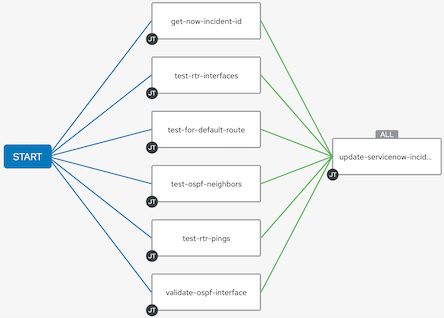
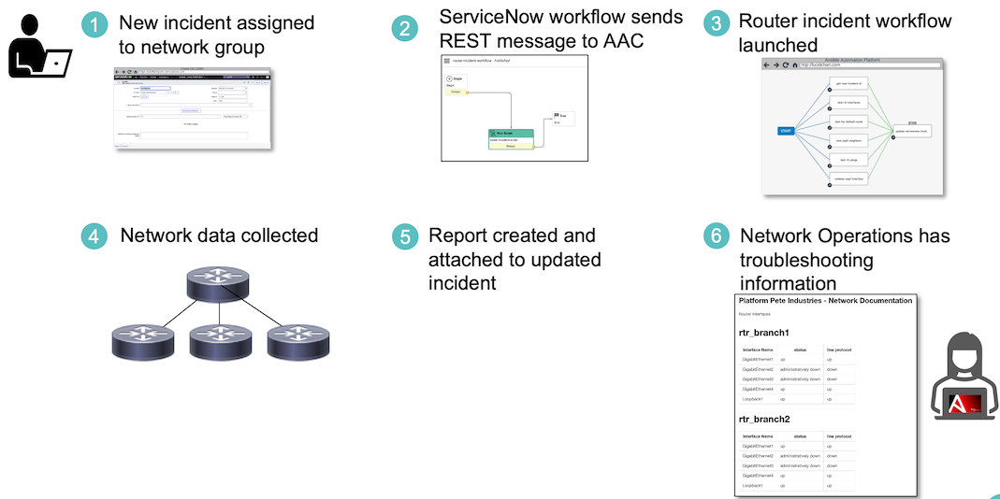

# Ansiblefest2022

### [Link to Ansiblefest Video](https://events.experiences.redhat.com/widget/redhat/rhaf22/SessionCatalog2022/session/1657916104035001IRzO)

## OD1281 - Network Troubleshooting as Code

[Presentation Summary](#summary)

[Example Output](#example-output)

[Solution Components](#the-components-of-our-solution)

[Demo Environment](#demo-environment)

[requirements](#requirements)

[ServiceNow and AAP Integration](#servicenow-and-aap)

## Summary

 So often when we think of network automation, we go right to configuration management, which is very powerful. However, there are many ways automation can help us even before we get to changing or updating configurations. Think of when a network team gets a ticket for site degradation or a site down, what are the first troubleshooting steps an engineer takes? 

This often involves logging into multiple routers and performing show commands to determine the current state of the network. This is repetitive work and can introduce human error.

What if we could automate those first-level tasks to speed up that process of data gathering? What if we could do some basic testing on that information to get to a faster time to resolution or diagnosis for an issue? That is what this presentation highlights.

Using Ansible Automation Platform and ServiceNow, we can gather this initial information from our network that we can use in the first stages of troubleshooting a potential issue.

### Example Output

An example of the report generated in markdown is availale in [playbooks/documentation/rtr-health-report.md](playbooks/documentation/rtr-health-report.md)

### The components of our solution

#### IOS Command Module

We could use the [ios_command](https://docs.ansible.com/ansible/latest/collections/cisco/ios/ios_command_module.html) module to issue show commands on our routers. 

```yaml
---
- name: show interfaces with command
  hosts: rtr_core
  gather_facts: false
  tasks:
  - name: show interfaces
    cisco.ios.command:
      commands: show ip interface brief
```

The issue with this is that it returns a list of strings, which can be hard to work with programmatically. 

```json
"iosxe_show_interface.stdout_lines": [
        [
            "Interface              IP-Address      OK? Method Status                Protocol",
            "GigabitEthernet1       192.168.1.2     YES manual up                    up      ",
            "GigabitEthernet2       192.168.2.2     YES manual up                    up      ",
            "GigabitEthernet3       192.168.3.2     YES manual up                    up      ",
            "GigabitEthernet4       10.253.175.156  YES DHCP   up                    up      ",
            "Loopback1              100.1.1.1       YES manual up                    up"
        ]
    ]
}
```

This has all the information we are looking for, but it still takes a human to parse through the mountains of text to make determiniation on what is happening.

#### CLI Parsing

Alternatively, we can use the [cli_parse](https://docs.ansible.com/ansible/latest/collections/ansible/utils/cli_parse_module.html#ansible-collections-ansible-utils-cli-parse-module) module with pyats as the parsing engine to return data in a more structured format.

```yaml
---
- name: show interface with parser
  hosts: rtr_core
  gather_facts: false  tasks:
  - name: show interfaces
    ansible.utils.cli_parse:
      command: show ip interface brief
      parser:
        name: ansible.netcommon.pyats
```

Once we have structured data, we can then extract the exact information that we want.

```json
"iosxe_show_interface": {
    "interface": {
        "GigabitEthernet1": {
            "interface_is_ok": "YES",
            "ip_address": "192.168.1.2",
            "method": "manual",
            "protocol": "up",
            "status": "up"
         },
```

#### Testing

In this demo, I am using two testing modules that are included in [ansible.builtin](https://docs.ansible.com/ansible/latest/collections/ansible/builtin/index.html)  and [ansible.utils](https://docs.ansible.com/ansible/latest/collections/ansible/utils/index.html#plugins-in-ansible-utils) collections.

With [Validate](https://docs.ansible.com/ansible/latest/collections/ansible/utils/validate_module.html#ansible-collections-ansible-utils-validate-module), you can match a pattern defined in a jsonschema file to the collected data and validate that the returned data matches that pattern.

With [Assert](https://docs.ansible.com/ansible/latest/collections/ansible/builtin/assert_module.html#ansible-collections-ansible-builtin-assert-module), you can basically ask a boolean question: If this question is true, then my test passes, if this question is false, then my test fails. For our purposes we are asking if the default route of ```0.0.0.0/0``` exists in the routing table.

```yaml
- name: assert that default route exists
  ansible.builtin.assert:
    that:
    - "'0.0.0.0/0' in {{ routing_table }}"
```

Once we have our tests in place, if a test fails, then the playbook fails. Ansible gives us a way to handle exceptions with the [blocks](https://docs.ansible.com/ansible/latest/user_guide/playbooks_blocks.html). Blocks allow us to group tasks together and to handle any errors by using rescue. Below is an example where we are going to build a dictionary based on the results of our test. If our test passes we will add a key to the ```ospf_def_route``` dictionary. If it fails, the rescue block runs, which will also add a key to the ```ospf_def_route``` dictonary with a value of ```False```.

```yaml
- name: check if default route exists
  block:
  - name: assert that default route exists
    ansible.builtin.assert:
      that:
      - "'0.0.0.0/0' in {{ routing_table }}”
      success_msg: “Default Route Exists”
  - name: set fact for default route success
    ansible.builtin.set_fact:
      ospf_def_route: {'default_route': True }
  rescue:
    - name: set fact for unsuccessful assertion
      ansible.builtin.set_fact:
        ospf_def_route: {'default_route': False }
```

#### Bringing it all together

We've built many tests located in our playbooks directory. We turn those playbooks into templates within AAC, we then link those templates into a workflow. The final step of our workflow is to use jinja2 to create both a markdown file to attach to our ServiceNow incident and a HTML output to include inline in incident work notes.



The final process looks like this from the time an incident gets opened, to the time it updates with the information.



This is a basic example with just four routers, but the ideas could be developed and deployed to suit different environments.

### Demo Environment

This Demo was tested and developed with ServiceNow Tokyo version and Ansible Automation Platform 2.2.
The network under test was an OSPF point-to-point network with three branch routers all connecting back to one core router. The router configuration was done using the playbooks/configure-cml-rtr.yml playbook. Provisioning of the routers was not part of the demo.playbooks/documents/rtr-health-report.md


The AAP environment used in this Demo consists of one Ansible Automation Controller, Three Exec Nodes, One DB, and One Private Automation Hub. The Automation Hub is used as a private repo for the Execution Environment images.


### Requirements

Required ansible collections are documented in the execution-environment/requirements.yml file

#### ServiceNow ITSM collection

The ITSM module used in this demo is accessible through [Red Hat Automation Hub](https://console.redhat.com/ansible/automation-hub/repo/published/servicenow/itsm "console.redhat.com").

#### Additional Collections Required

[Cisco.IOS](https://docs.ansible.com/ansible/latest/collections/cisco/ios/index.html "cisco.ios collection")

[Ansible.utils](https://docs.ansible.com/ansible/latest/collections/ansible/utils/index.html "ansible.utils collection")

All required python packages are documented in the file [requirements.txt](execution-environment/requirements.txt)
All required ansible collections are documented in the file [requirements.yml](execution-environment/requirements.yml)

### ServiceNow and AAP

<details>
  <summary>Setting up AAP and ServiceNow communication</summary>

1. Create Authentication
   1. Record Redirect URI of your servicenow instance. The redirect will be this format ``` {{https://yourinstance}}.service-now.com/oauth_redirect.do ```
   2. In the Ansible Automation Controller (AAC) go to Administration > Applications and add a new application. Give it a name and input the redirect URI. The authorization grant type should be 'Authorization Code' and the Client type should be 'confidential.' This will generate a client ID and client secret. Save these tokens for later use.
   3. In ServiceNow go to System OAth > Application Registry
   4. Click the New button to create a new Third-Party OAuth provider, input your client ID and client secret you generated in AAC. The default grant type should be 'Authorization Code.'
   5. For authorization URL the value will be ``` {{https://your_aac_address}}/api/o/authorize/ ``` and the token URL will be ``` {{https://your_aac_address}}/api/o/token/ ``` Right click on the gray bar at the top and select save.
   6. Click on the 'OAuth Entity Scopes' tab. Click where it says 'Insert a New Row.' Under Name enter 'Writing Scope' and for OAuth Scope input 'write.' Click update.

2. Create REST Message
   1. In AAP find the API endpoint of the template of workflow you wish to launch (ex. ``` https://{{your_aac_address}}/api/v2/workflow_job_templates/14/launch/ ```.)
   2. Go to System Web Services > Outbound > REST Messages, click on NEW to create a Rest Message
   3. Enter the API Endpoint in the Endpoint field
   4. Authentication type should be OAuth and associate the previously created OAuth profile
   5. Click the link that says 'Get OAuth Token.' This should retrieve the OAuth token from your AAC.
   6. Once you have the OAuth token, you are ready to create the rest message. Under HTTP methods, click on New.
   7. The method type should be 'post,' and the API endpoint should be the same as entered previously.
   8. Under the 'Authentication' tab, select 'OAuth 2.0' and select the previously created OAuth profile
   9. Click on the 'HTTP Request' tab and under 'HTTP Headers' click on 'Insert a new row...' The Name should be 'Content-Type' and the values should be 'application/json'

These are the steps to setup communication between ServiceNow and AAP using OAuth. Additionally, if you wanted to pass variables to AAP, you would do that in the HTTP Method screen. In this example I am setting HTTP Query Parameters with the Content ```{"extra_vars": { "incident_id": "${incident_id}" } } ```. I then set the variable substition with 'incident_id.' This allows the workflow to pass the incident ID to AAP when it sends this REST message. There is also a link in this form for 'Preview Script Usage.' You can use this script in setting up the ServiceNow workflow in workflow editor.

</details>

## Authors

- Bob Longmore bob.longmore@wwt.com
